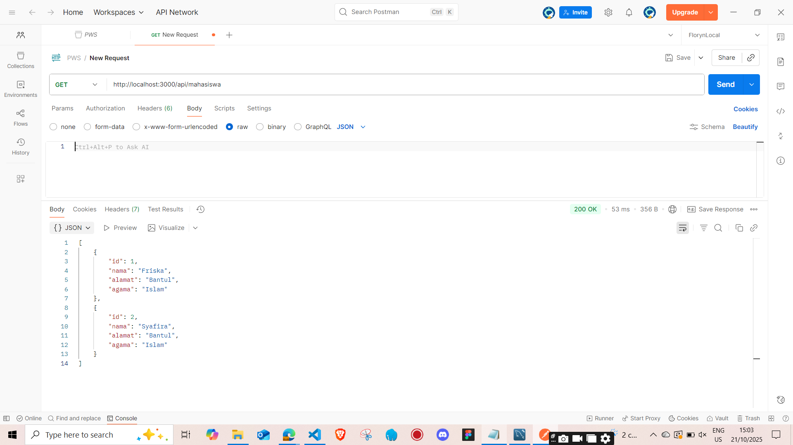
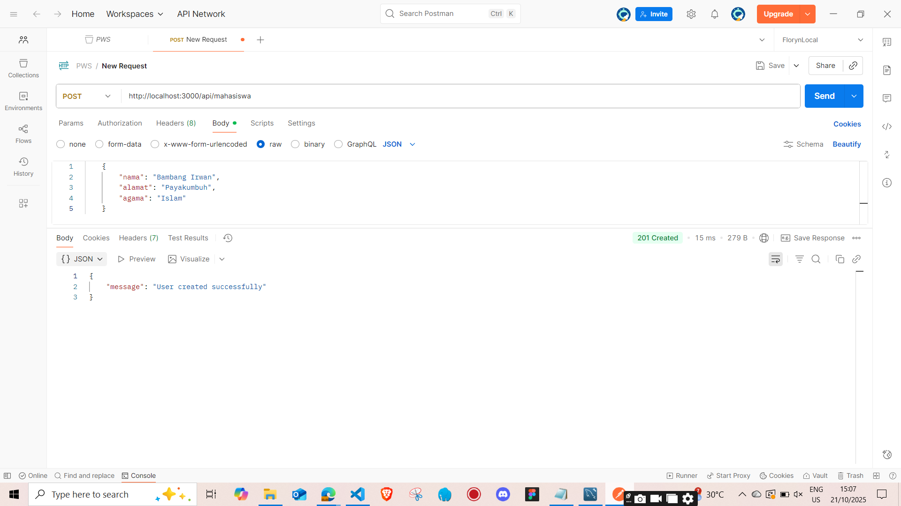
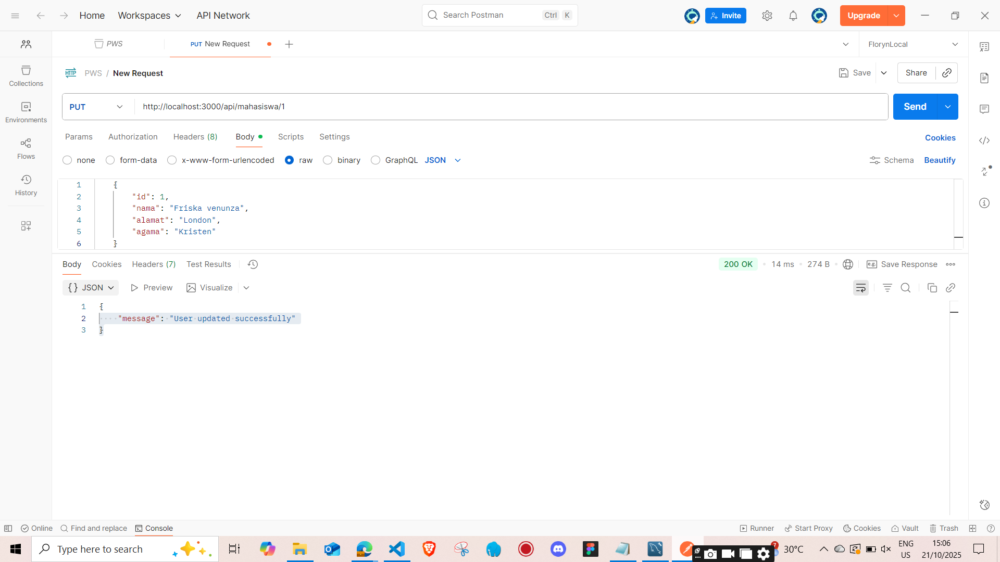
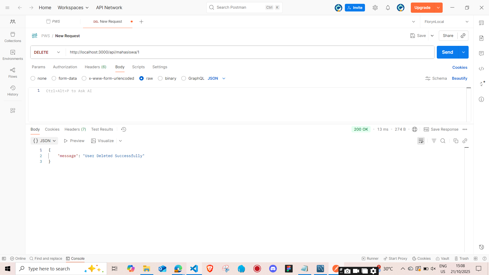

# Dokumentasi Endpoint API Mahasiswa

Berikut adalah dokumentasi visual dari masing-masing endpoint yang telah diimplementasikan pada proyek ini.

## 📸 Screenshot Endpoint

| Gambar | Deskripsi |
|--------|------------|
|  | **GET /api/mahasiswa** — Menampilkan seluruh data mahasiswa dari tabel `biodata`. |
|  | **POST /api/mahasiswa** — Menambahkan data mahasiswa baru ke dalam tabel `biodata`. |
|  | **PUT /api/mahasiswa/:id** — Memperbarui data mahasiswa berdasarkan `id`. |
|  | **DELETE /api/mahasiswa/:id** — Menghapus data mahasiswa berdasarkan `id`. |

---

## ⚙️ Teknologi yang Digunakan
- **Node.js** dengan **Express.js** sebagai backend framework  
- **MySQL** sebagai database  
- **RESTful API** untuk komunikasi data  

## 📁 Struktur Folder
